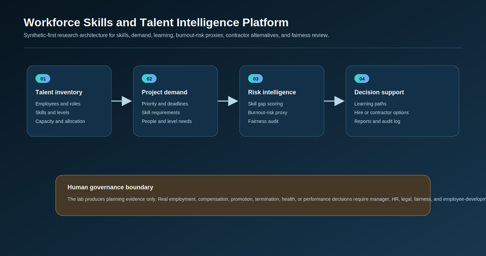
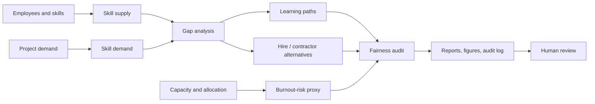

# Elite Talent & Capacity Command

<p align="center"><strong>Workforce Skills and Talent Intelligence Platform for skills tracking, project demand, learning paths, hiring gaps, burnout-risk proxies, contractor alternatives, fairness audits, and executive workforce planning.</strong></p>

> **Human-governance boundary:** this project includes a React planning workspace and a synthetic Python research lab. The Python lab uses fictional data only. It must not be used to automate real hiring, firing, compensation, promotion, health, or performance decisions.

---

## What this repository now contains

This started as a React workforce-planning workspace for **Elite Era Development L.L.C.**. It now also includes a research-grade synthetic workforce intelligence lab.

| Layer | Purpose |
| --- | --- |
| React dashboard | Browser-based workforce planning workspace |
| Synthetic workforce lab | Generates fictional employees, skills, projects, contractors, and workload signals |
| Skill intelligence | Tracks supply, demand, seniority, and project skill gaps |
| Capacity and burnout | Estimates workload utilization and burnout-risk proxy bands |
| Learning paths | Recommends upskilling options for people near important skill gaps |
| Hiring and contractor alternatives | Compares urgent skill gaps with contractor-market options |
| Fairness audit | Checks subgroup differences in utilization, burnout risk, and learning access |
| Audit trail | Writes hash-chained local experiment records |

---

## Architecture

<p align="center"></p>



---

## Browser dashboard

```bash
npm install
npm run dev
```

Open the address shown in the terminal, normally `http://localhost:5173`.

Checks:

```bash
npm test
npm run build
```

---

## Synthetic workforce intelligence lab

Run the Python lab without any real HR data:

```bash
python scripts/run_synthetic_workforce_lab.py
```

Windows quick start:

```bat
cd %USERPROFILE%\elite-talent-capacity-command
git pull

py -m venv .venv
.venv\Scripts\activate

python -m pip install --upgrade pip
python -m pip install -r requirements.txt
python scripts/run_synthetic_workforce_lab.py
```

Optional controls:

```bash
python scripts/run_synthetic_workforce_lab.py --employees 120 --projects 24 --seed 42
```

---

## Generated local outputs

```text
outputs/results/synthetic_employees.csv
outputs/results/synthetic_employee_skills.csv
outputs/results/synthetic_projects.csv
outputs/results/synthetic_project_skill_demand.csv
outputs/results/synthetic_skill_supply.csv
outputs/results/synthetic_skill_gaps.csv
outputs/results/synthetic_burnout_risk.csv
outputs/results/synthetic_learning_paths.csv
outputs/results/synthetic_staffing_alternatives.csv
outputs/results/synthetic_fairness_audit.csv
outputs/results/synthetic_contractors.csv
outputs/results/synthetic_workforce_summary.json
outputs/reports/synthetic_workforce_report.md
outputs/audit/workforce_audit_log.jsonl

outputs/figures/synthetic_skill_gap_risk.png
outputs/figures/synthetic_burnout_distribution.png
outputs/figures/synthetic_learning_path_mix.png
outputs/figures/synthetic_staffing_alternatives.png
outputs/figures/synthetic_fairness_audit.png
```

All generated data is synthetic and local.

---

## Research questions

| Research question | Evidence generated locally |
| --- | --- |
| Which skills are under-supplied for high-priority projects? | Skill gap table and gap-risk figure |
| Which teams or employees appear overloaded? | Burnout-risk proxy table and distribution |
| Which gaps should be solved by learning, hiring, or contractors? | Learning-path and staffing-alternative tables |
| Are workforce recommendations distributed fairly across groups? | Fairness audit table and group-risk figure |
| Can the analysis remain auditable? | Hash-chained JSONL audit log |

---

## Metrics and boundaries

| Metric | Meaning | Boundary |
| --- | --- | --- |
| Skill gap risk | Shortage, project priority, deadline, and business value | Synthetic planning signal |
| Burnout risk | Utilization, engagement, attrition signal, and tenure proxy | Not a medical or HR diagnosis |
| Learning recommendation | Suggested course path for a skill gap | Requires manager and employee review |
| Contractor alternative | Synthetic market option for urgent gaps | Not procurement advice |
| Fairness gap | Group difference in utilization, risk, and learning access | Audit signal requiring review |

---

## Python repository map

```text
src/workforceintel/
├── synthetic.py       Fictional employees, skills, projects, contractors
├── analysis.py        Skill gaps, burnout proxy, staffing alternatives
├── learning.py        Learning-path recommendations
├── fairness.py        Subgroup audit signals
├── visualization.py   Generated charts
├── reporting.py       Markdown report
├── audit.py           Hash-chained audit log
└── config.py          Seeds and output folders
```

---

## Documentation

- [`docs/workforce_intelligence_methodology.md`](docs/workforce_intelligence_methodology.md)
- [`docs/workforce_ethics_policy.md`](docs/workforce_ethics_policy.md)
- [`data/README.md`](data/README.md)

---

## MATLAB workflow

After running the Python lab:

```matlab
addpath('matlab')
plot_workforce_metrics('outputs')
```

---

## Reproducibility

Run Python tests:

```bash
python -m pytest tests/test_workforce_*.py
```

The repo also keeps the original React checks:

```bash
npm test
npm run build
```

## Limitations

1. Synthetic workforce data does not represent real employees or organizations.
2. Burnout risk is a workload planning proxy, not a diagnosis.
3. Fairness gaps are research signals, not legal conclusions.
4. Contractor and hiring alternatives are planning evidence, not procurement decisions.
5. Real deployment requires HR, legal, privacy, security, fairness, and employee-relations review.

Made by **Hira Khyzer** for **Elite Era Development L.L.C.**
